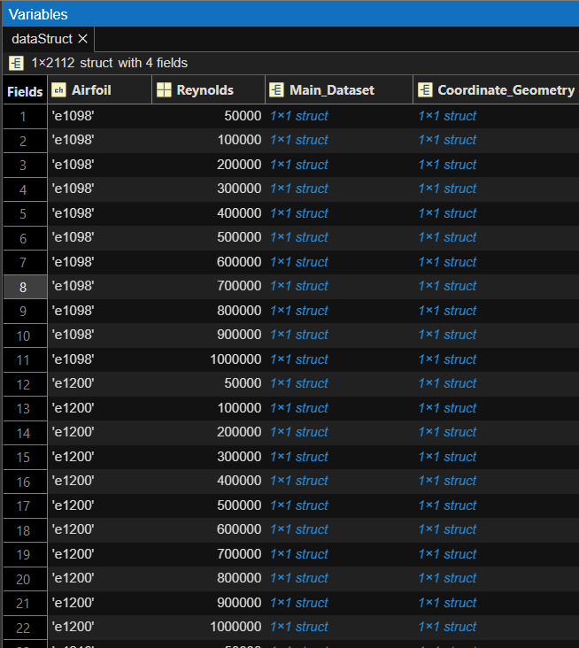

# Machine_Learning_Eppler_Series
## Project Overview

This project focuses on using machine learning to analyze and generate Eppler series airfoil designs. The workflow consists of several stages: data preparation, data processing, model training, and model deployment using MATLAB and XFLR5.

---
## 1️⃣ Data Collection and Initial Structuring

The first step in this project was to collect raw data for the Eppler series airfoils. The airfoil geometry and aerodynamic performance data were organized into a systematic structure for further processing.

### 📂 Dataset Overview

- **Source Website:** [airfoiltools.com](https://airfoiltools.com/)
- **Airfoil Series:** Eppler
- **Total Airfoils:** 192
- **Geometry Files:** `.dat` files (coordinate files)
- **Performance Files:** `.csv` files (performance data extracted from XFLR5)

### 📌 Task Goals for This Section:

- Load all `.dat` geometry files.
- Load corresponding `.csv` performance files for each Reynolds number.
- Store all data into a MATLAB structure `dataStruct` for easy access and processing.

---

### 🔧 Code Explanation

```matlab
% Set random seed for reproducibility
rng(2025)

% Define the folder path where all files are stored
folderPath = "C:\Users\Mohammed Nadeem\Desktop\Eppler Machine Learing Model\Airfoil Dataset";

% List all .dat files (coordinate geometry files)
dat_files = dir(fullfile(folderPath, '*.dat'));
airfoil_names = unique(erase({dat_files.name}, '.dat'));

% Reynolds numbers list
Re_list = [50000,100000,200000,300000,400000,500000,600000,700000,800000,900000,1000000];
nCases = length(Re_list);

% Preallocate struct array dynamically
dataStruct = struct();
idx = 1;

for a = 1:length(airfoil_names)
    airfoil = airfoil_names{a};
    coord_file = fullfile(folderPath, [airfoil '.dat']);
    
    % Read coordinate geometry once per airfoil
    try
        coord_data = readmatrix(coord_file);  % Geometry is numerical
    catch ME
        coord_data = [];
        warning('Could not read coordinate file %s\nError: %s', coord_file, ME.message);
    end
    
    for i = 1:nCases
        Re_num = Re_list(i);
        fprintf('\nProcessing Airfoil: %s | Re: %d\n', airfoil, Re_num);
        main_file = fullfile(folderPath, sprintf('%s_Re%d.csv', airfoil, Re_num));

        % Read main dataset as raw cell array
        try
            main_data = readcell(main_file, 'Delimiter', ',');
        catch ME
            main_data = [];
            warning('Could not read main file %s\nError: %s', main_file, ME.message);
        end

        % Store data into struct
        dataStruct(idx).Airfoil = airfoil;
        dataStruct(idx).Reynolds = Re_num;
        dataStruct(idx).Main_Dataset.file = main_file;
        dataStruct(idx).Main_Dataset.data = main_data;
        dataStruct(idx).Coordinate_Geometry.file = coord_file;
        dataStruct(idx).Coordinate_Geometry.data = coord_data;

        idx = idx + 1;
    end
end
```

---

✅ **Output of This Stage:**  
At the end of this section, a large `dataStruct` is created in MATLAB containing all the loaded airfoil geometries and aerodynamic performance data.



*Figure 1: Data Struct created in MATLAB for organization*


*Figure 2: Performance Data a.k.a Main_Dataset in MATLAB*


*Figure 3: Coordinates of the Goemetries extracted from the .dat files*

---
## 2️⃣ Data Cleaning and Preprocessing

Once the raw data was successfully loaded into the structured format (`dataStruct`), the next step was to clean and prepare it for further analysis and model development.

---

## 🎯 Objective of this Stage

- Remove redundant rows and columns from the dataset.
- Ensure only relevant performance parameters are retained.
- Handle missing data by removing rows with incomplete records.

---

## 📂 Process Summary

- **Input:** `Workspace_Raw_Data.mat` (created in Section 1)
- **Main Dataset:** Performance data extracted from `.csv` files.
- **Output:** Cleaned `dataStruct` with properly formatted tables.

---

## 🔧 Code Explanation

### 1️⃣ Load Raw Data

```matlab
% Load the previously created data structure
load("Workspace_Raw_Data.mat")
```

### 2️⃣ Remove Redundant Rows and Columns

- The original performance data contained extra header rows and unnecessary columns.
- Keep only rows 7 and onward.
- Retain only the first 8 columns: Alpha, Cl, Cd, CDp, Cm, Top Xtr, Bot Xtr, Cpmin.

```matlab
% Remove rows from 1 to 6 from Main_Dataset and keep the first 8 columns
for idx = 1:length(dataStruct)
    if isfield(dataStruct(idx), 'Main_Dataset') && ...
       isfield(dataStruct(idx).Main_Dataset, 'data') && ...
       ~isempty(dataStruct(idx).Main_Dataset.data)

        C = dataStruct(idx).Main_Dataset.data;  % Cell array, 1st row = headers

        % Remove rows 1 to 6 and keep only the first 8 columns
        filteredData = C(7:end, 1:8);  % Keep rows from 7 onwards and first 8 columns

        % Convert to table and label the columns
        dataTable = cell2table(filteredData, 'VariableNames', {'Alpha', 'Cl', 'Cd','CDp','Cm','Top Xtr','Bot Xtr','Cpmin'});

        % Store the table back into the struct
        dataStruct(idx).Main_Dataset.data = dataTable;
    end
end
```


*Figure 4: Unnecessary Row and Columns were removed from the Perfromance Data*

### 3️⃣ Handle Missing Values

- Remove any rows that contain missing (empty or NaN) values to ensure clean data for ML training.

```matlab
% Check for any missing values and remove them
for idx = 1:length(dataStruct)
    if isfield(dataStruct(idx), 'Main_Dataset') && ...
       isfield(dataStruct(idx).Main_Dataset, 'data') && ...
       ~isempty(dataStruct(idx).Main_Dataset.data)

        dataTable = dataStruct(idx).Main_Dataset.data;  % Table format

        % Remove rows with any missing values
        dataTable = rmmissing(dataTable);

        % Store the cleaned table back into the struct
        dataStruct(idx).Main_Dataset.data = dataTable;
    end
end
```

---

## ✅ Output of This Stage

- The original messy raw data is now fully cleaned and stored inside `dataStruct`.
- Each airfoil case contains only valid, clean, and ready-to-use performance data.

---
## 3️⃣ Exploratory Data Analysis (EDA)

After cleaning the dataset, exploratory data analysis was performed to better understand the relationships between different performance parameters of the airfoils.

---

## 🎯 Objective of this Stage

- Visualize correlation between features.
- Identify strong and weak relationships among the extracted aerodynamic coefficients.
- Gain insights to support feature engineering and model training.

---

## 📂 Process Summary

- **Input:** Cleaned `dataStruct` from Section 2
- **Analysis Tool:** Correlation Matrix and Heatmap visualization
- **Output:** Correlation plot that shows the strength of relationships between parameters.

---

## 🔧 Code Explanation

### 1️⃣ Variable Preparation

We selected the following features for correlation analysis:

- Alpha (Angle of Attack)
- Cl (Lift Coefficient)
- Cd (Drag Coefficient)
- CDp (Profile Drag Coefficient)
- Cm (Moment Coefficient)
- Top Xtr (Upper Surface Transition)
- Bot Xtr (Lower Surface Transition)
- Cpmin (Minimum Pressure Coefficient)

```matlab
% Define variable names for columns 1 to 8
varNames = {'Alpha', 'Cl', 'Cd', 'CDp', 'Cm', 'Top Xtr', 'Bot Xtr', 'Cpmin'};
```

---

### 2️⃣ Aggregate Data from All Airfoils

We aggregated all the cleaned data across the full dataset into a single array for correlation calculation.

```matlab
% Aggregate numeric data from all datasets (columns 1 to 8)
allData = [];
for idx = 1:length(dataStruct)
    if ~isempty(dataStruct(idx).Main_Dataset.data)
        T = dataStruct(idx).Main_Dataset.data;
        T = T(:,1:8); % Restrict to columns 1-8
        numericVars = varfun(@isnumeric, T, 'OutputFormat', 'uniform');
        allData = [allData; T{:, numericVars}];
    end
end
```

---

### 3️⃣ Generate Correlation Matrix & Heatmap

Finally, we computed the correlation coefficients and visualized them using MATLAB’s heatmap function.

```matlab
% Compute correlation matrix
R = corr(allData, 'Rows', 'complete');

% Create heatmap with custom axis labels
figure;
h = heatmap(varNames, varNames, R);

% Add title and axis labels
h.Title = 'Combined Correlation Matrix (Columns 1 to 8)';
h.XLabel = 'Variables';
h.YLabel = 'Variables';
```


*Figure 5: Correlation Plot for the features from the Performance Data*

---

## ✅ Output of This Stage

- Heatmap displaying pairwise correlation between all features.
- Helps to understand multicollinearity and feature importance for ML model development.

---
## 4️⃣ Feature Engineering & GUI Plotting

In this stage, we added important features to the dataset and developed an interactive MATLAB GUI for data visualization.

---

## 🎯 Objectives

- Create additional aerodynamic features to improve model performance.
- Provide user-friendly visualization of airfoil performance and geometry.

---

## 📂 Process Summary

### 1️⃣ Feature Engineering

- Calculated new feature: **Cl/Cd** ratio (Lift-to-Drag Ratio).
- Added this as an extra column in the dataset for each airfoil.

```matlab
% Calculate Cl/Cd and add to the dataset
for idx = 1:length(dataStruct)
    if isfield(dataStruct(idx), 'Main_Dataset') && isfield(dataStruct(idx).Main_Dataset, 'data') && ~isempty(dataStruct(idx).Main_Dataset.data)
        dataTable = dataStruct(idx).Main_Dataset.data;

        Cl = dataTable.Cl;
        Cd = dataTable.Cd;

        ClCd = Cl ./ Cd;
        ClCd(Cd == 0) = NaN; % Avoid division by zero

        dataTable.ClCd = ClCd;

        dataStruct(idx).Main_Dataset.data = dataTable;
    end
end
```


*Figure 6: The ratio of Cl and Cd is being added in the last column for visualisation*

2️⃣ GUI Plotting
An interactive MATLAB GUI was created to visualize:
- Cl vs Cd
- Cl vs Alpha
- Cd vs Alpha
- Cl/Cd vs Alpha
- Cl & Cd vs Alpha (superimposed dual-axis plot)
- Airfoil Geometry (X vs Y)

The GUI allows the user to select:
- Airfoil + Reynolds Number combination
- Type of plot

The plots are then generated accordingly.

✅ Key code used to launch GUI:
```
% Call the airfoilPlotterGUI function with the processed dataStruct
airfoilPlotterGUI(dataStruct)
```
✅ Main GUI logic (simplified structure):
```
% Create main figure window with dropdown menus for airfoil and plot type
f = figure('Name', 'Airfoil Plotter');

% Dropdown list of Airfoil + Re combinations
airfoilReList = arrayfun(@(s) sprintf('%s_Re=%d', string(s.Airfoil), s.Reynolds), dataStruct, 'UniformOutput', false);
popupAirfoil = uicontrol(f, 'Style', 'popupmenu', 'String', airfoilReList);

% Dropdown list of plot options
popupPlot = uicontrol(f, 'Style', 'popupmenu', 'String', {'Cl vs Cd', 'Cl vs Alpha', 'Cd vs Alpha', 'Cl/Cd vs Alpha', 'Geometry (X vs Y)', 'Cl & Cd vs Alpha'});

% Plot Button executes the plotting based on user selection
uicontrol(f, 'Style', 'pushbutton', 'String', 'Plot', 'Callback', @(~,~) plotSelected(dataStruct, popupAirfoil, popupPlot, ax));
```


*Figure 7: GUI for plotting the existing database for visualization*

**✅ Output of This Stage**

- Fully cleaned dataset with additional Cl/Cd feature.
- Interactive GUI for visualizing all key aerodynamic relationships and airfoil geometry.
---
## 5️⃣ Coordinate Geometry Flattening

In this stage, we incorporated **airfoil geometry coordinates** directly into the performance dataset to prepare a complete dataset for machine learning.

---

## 🎯 Objectives

- Convert 2D geometry coordinate data into 1D flattened vectors.
- Merge the flattened geometry data into the main dataset for each airfoil-Reynolds combination.

---

## 📂 Process Summary

### 1️⃣ Flatten Geometry Coordinates

- Original geometry files contain columns of X and Y coordinates.
- We flatten the coordinates into one row:  
  `[x1, x2, ..., xn, y1, y2, ..., yn]`.

- This flattened geometry is repeated for every corresponding aerodynamic record in the dataset to match their dimensions.

### 2️⃣ Insert Flattened Geometry into Dataset

- The flattened geometry was inserted into each data table after the 9th column (after `Cl/Cd` column).
- Geometry variables were named as:  
  `x1, x2, ..., xn, y1, y2, ..., yn` (where `n` is the number of geometry points, e.g., 61).

---

## ✅ Key Code Logic

```matlab
for i = 1:length(dataStruct)
    entry = dataStruct(i);

    % Skip if missing geometry or main dataset
    if isempty(entry.Coordinate_Geometry.data) || isempty(entry.Main_Dataset.data)
        continue;
    end

    % Flatten geometry into row vector
    geom = entry.Coordinate_Geometry.data;
    x = geom(:, 1)';
    y = geom(:, 2)';
    geom_flat = [x, y];

    % Convert main dataset to table
    raw = entry.Main_Dataset.data;
    if iscell(raw)
        headers = string(raw(1, :));
        dataRows = raw(2:end, :);
        T = cell2table(dataRows, 'VariableNames', headers);
    elseif istable(raw)
        T = raw;
    else
        warning("Unrecognized format");
        continue;
    end

    % Create geometry table matching T rows
    nRows = height(T);
    geomTable = array2table(repmat(geom_flat, nRows, 1));
    nPoints = length(x);
    xVars = "x" + (1:nPoints);
    yVars = "y" + (1:nPoints);
    geomTable.Properties.VariableNames = [xVars, yVars];

    % Merge geometry columns into Main_Dataset
    T = [T(:,1:9), geomTable, T(:,10:end)];
    dataStruct(i).Main_Dataset.data = T;
end
```
## ✅ Output of This Stage

- Each aerodynamic record now includes its corresponding geometry.
- The dataset is now fully ready for ML preprocessing.
---
## 6️⃣ Coordinate Geometry Resampling

In this stage, we standardized all airfoil geometries by resampling them to a **fixed number of coordinate points**.  
This ensures that all geometry data have equal length, which is required for ML model training.

---

## 🎯 Objectives

- Resample every airfoil coordinate geometry to the same number of points (e.g. `targetPoints = 50`).
- Handle inconsistent geometry lengths across different airfoils.
- Eliminate NaN or missing geometry values before interpolation.

---

## 📂 Process Summary

### Why Resample?
- Original coordinate files had inconsistent number of X, Y points.
- Machine Learning models require same-sized feature vectors.
- Arc-length parameterization was used to resample coordinates uniformly along the airfoil shape.

---

## ✅ Key Code Logic

```matlab
targetPoints = 50;  % Desired number of resampled x and y points

for i = 1:numel(dataStruct)
    T = dataStruct(i).Main_Dataset.data;

    % Identify geometry columns
    varNames = string(T.Properties.VariableNames);
    xCols = varNames(startsWith(varNames, 'x'));
    yCols = varNames(startsWith(varNames, 'y'));

    if isempty(xCols) || isempty(yCols)
        warning('Skipping entry %d: No geometry columns found.', i);
        continue;
    end

    xVals = T{:, xCols};
    yVals = T{:, yCols};

    xNew_all = zeros(height(T), targetPoints);
    yNew_all = zeros(height(T), targetPoints);

    for r = 1:height(T)
        x = xVals(r, :);
        y = yVals(r, :);

        valid = ~isnan(x) & ~isnan(y);
        x = x(valid);
        y = y(valid);

        if length(x) < 2
            warning('Row %d has insufficient geometry points. Skipping.', r);
            continue;
        end

        s = [0, cumsum(sqrt(diff(x).^2 + diff(y).^2))];
        s = s / max(s);

        [sUnique, ia] = unique(s);
        x = x(ia);
        y = y(ia);

        sNew = linspace(0, 1, targetPoints);
        xNew = interp1(sUnique, x, sNew, 'linear', 'extrap');
        yNew = interp1(sUnique, y, sNew, 'linear', 'extrap');

        xNew_all(r, :) = xNew;
        yNew_all(r, :) = yNew;
    end

    % Create column names
    xNewNames = compose("x%03d", 1:targetPoints);
    yNewNames = compose("y%03d", 1:targetPoints);

    geomTable = array2table([xNew_all, yNew_all], 'VariableNames', [xNewNames, yNewNames]);

    % Replace old geometry with resampled geometry
    T(:, [xCols, yCols]) = [];
    dataStruct(i).Main_Dataset.data = [T geomTable];
end
```
## ✅ Output of This Stage

- Now every airfoil geometry has exactly 50 x-coordinates and 50 y-coordinates.
- Each record is now fully normalized and ready for final dataset assembly.
---
## 7️⃣ Combine All Struct Entries into One Table

In this stage, we consolidate all cleaned and processed airfoil records into a single **master table** for machine learning.

---

## 🎯 Objectives

- Convert individual airfoil structs into a single large table.
- Add airfoil name and Reynolds number as columns.
- Fully assemble one dataset for ML model input.

---

## 📂 Process Summary

Each entry in `dataStruct` contains:

- Cleaned performance data.
- Added features (e.g. `Cl/Cd`).
- Resampled airfoil geometry.

We now combine all of these into one unified table `Training_Data_Table`.

---

## ✅ Key Code Logic

```matlab
% Initialize final table
Training_Data_Table = table();

% Loop through all entries
for i = 1:numel(dataStruct)
    entry = dataStruct(i);

    % Skip if Main_Dataset is missing
    if isempty(entry.Main_Dataset.data)
        continue;
    end

    % Get the table
    T = entry.Main_Dataset.data;

    % Add identifier columns
    T.Airfoil = repmat(string(entry.Airfoil), height(T), 1);
    T.Re = repmat(entry.Reynolds, height(T), 1);

    % Reorder columns: Airfoil | Re | ...
    T = movevars(T, {'Airfoil', 'Re'}, 'Before', 1);

    % Append to main table
    Training_Data_Table = [Training_Data_Table; T];
end
```
## ✅ Output of This Stage
- A fully flattened dataset where:
    - Each row = one performance case (airfoil + Reynolds + AoA).
    - Geometry & performance combined.
    - Airfoil name & Reynolds number included as features.
- The dataset is now directly ready for machine learning model training.
---
## 8️⃣ Dimensionality Reduction with PCA
After cleaning and combining the dataset, the next crucial step is to analyze the underlying structure of the data and reduce its dimensionality. Principal Component Analysis (PCA) is an effective statistical tool to identify the most important features, reduce noise, and visualize relationships.

## 🎯 Goals for This Section:

- Clean the dataset by removing invalid entries.
- Remove constant (non-informative) variables.
- Standardize features to zero mean and unit variance.
- Compute principal components and analyze explained variance.
- Visualize PCA results via Pareto charts and biplots.
- Explore 3D PCA projections with variable loadings.

## 🔧 Code Explanation
```matlab
% Remove rows with any NaN or Inf values (critical for PCA)
allData = allData(all(all(isfinite(allData),2), 2), :);

% Identify and remove constant columns (zero variance)
variances = var(allData);
constantCols = variances == 0;
allData(:, constantCols) = [];
varNamesCleaned = varNames(~constantCols);  % Update variable names accordingly

% Standardize data: zero mean, unit variance
allData_norm = zscore(allData);

% Perform PCA on standardized data
[coeff, score, latent, tsquared, explained] = pca(allData_norm);

% Visualize variance explained by each principal component with Pareto chart
figure;
pareto(explained)
xlabel('Principal Component')
ylabel('Variance Explained (%)')
title('PCA Pareto Chart')

% Visualize loadings and scores with 2D biplot
figure;
biplot(coeff(:,1:2), 'Scores', score(:,1:2), 'VarLabels', varNamesCleaned)
title('PCA Biplot')
grid on

% Display explained variance in command window
disp('Explained Variance (%):')
disp(explained)
disp('Cumulative Explained Variance (%):')
disp(cumsum(explained))

% 3D PCA visualization of first three components with variable loadings
figure
scatter3(score(:,1), score(:,2), score(:,3), 10, 'filled', 'MarkerFaceColor',[1 0.5 0]) % Orange color
xlabel('PC 1')
ylabel('PC 2')
zlabel('PC 3')
title('3D PCA Biplot')
grid on
hold on

% Plot variable loadings as arrows in 3D space
scale = 3; % Adjust for visibility
for i = 1:size(coeff,1)
    quiver3(0, 0, 0, scale*coeff(i,1), scale*coeff(i,2), scale*coeff(i,3), ...
        'LineWidth', 2, 'Color', 'b')
    text(scale*coeff(i,1), scale*coeff(i,2), scale*coeff(i,3), varNamesCleaned{i}, ...
        'FontSize', 12, 'Color', 'cyan')
end
hold off
```
## ✅ What We Achieved Here:

- The dataset was preprocessed to be PCA-ready by cleaning and standardizing.
- PCA revealed how much variance each principal component explains.
- Visualizations such as the Pareto chart and biplots help interpret the main features and their relationships.
- The 3D biplot further assists in understanding the complex interactions between variables in reduced dimensions.
---
## Extracting Predictors and Responses for Neural Network Training
## 9️⃣ Preparing Data for Model Training
Before training the neural network, it is essential to separate the dataset into predictors (input features) and responses (output targets). In this project, the predictors include key aerodynamic performance parameters, while the responses are the flattened airfoil coordinate geometries.

## 🎯 Goals for This Section:
- Extract relevant predictor variables from the combined dataset.
- Extract the flattened airfoil geometry coordinates as response variables.
- Save the prepared data for later use in training machine learning models.

## 🔧 Code Explanation
```matlab
Copy
Edit
% Extract predictor variables: aerodynamic parameters
Predictor_Var = Training_Data_Table{:, {'Alpha', 'Cl', 'Cd', 'Cdp', 'ClCd'}};

% Extract response variables: flattened geometry coordinates starting from 12th column
geometryVarNames = Training_Data_Table.Properties.VariableNames(12:end);
Response_Var = Training_Data_Table{:, geometryVarNames};

% Save predictors and responses into a .mat file for reuse
save('NN_Training_Data.mat', 'Predictor_Var', 'Response_Var');
```
## ✅ What We Achieved Here:
- The model inputs (Predictor_Var) now contain aerodynamic performance parameters:
    - Angle of Attack (Alpha)
    - Lift Coefficient (Cl)
    - Drag Coefficient (Cd)
    - Profile Drag Coefficient (Cdp)
    - Lift-to-Drag Ratio (ClCd)
- The outputs (Response_Var) represent the flattened airfoil coordinate geometries used as ground truth for shape prediction.
- Data saved into NN_Training_Data.mat ensures reproducibility and ease of use in later model training steps.
---
# Neural Network Airfoil Geometry Prediction

This repository contains MATLAB code for training, predicting, and visualizing airfoil geometry using a neural network model based on aerodynamic parameters.

---
## 🔟 Model Training

## Overview

This project demonstrates a complete pipeline to:

- Train a neural network to predict airfoil geometry coordinates from aerodynamic parameters.
- Provide a reusable prediction function for inference.
- Develop an interactive MATLAB GUI for user-friendly input, plotting, and exporting of predicted airfoil shapes.

---

## Files

| Filename                     | Description                                             |
| ---------------------------- | ------------------------------------------------------- |
| `Model1_Levenberg_Algorithm.m` | Train a recurrent neural network using Levenberg-Marquardt algorithm |
| `myNeuralNetworkFunction.m`  | Function to load the trained network and predict geometry |
| `PredictAirfoilGUI.m`        | GUI to input parameters, plot predicted airfoil, and export data |

---

## 1. Training the Neural Network Model

The core of this project is a Layered Recurrent Neural Network (RNN) trained to learn the relationship between aerodynamic inputs and airfoil geometry points.

**Input parameters:**

- Angle of attack (`Alpha`)
- Lift coefficient (`Cl`)
- Drag coefficient (`Cd`)
- Profile drag coefficient (`Cdp`)

**Output:**

- X and Y coordinates of airfoil geometry (20 points each, concatenated into a 40-element vector)

### Key Points:

- Uses MATLAB's `layrecnet` with 30 hidden neurons.
- Trained with Levenberg-Marquardt backpropagation (`trainlm`).
- Data divided into 80% training, 10% validation, 10% test.
- Trained network saved as `Net1` in `Trained_Net1.mat`.

### Example code snippet from `Model1_Levenberg_Algorithm.m`:

```matlab
net = layrecnet(1:2, 30);
net.trainFcn = 'trainlm';
[net, tr] = train(net, X, Y, 'useParallel', 'yes');
save('Trained_Net1.mat', 'net');
```
## 2. Prediction Function (myNeuralNetworkFunction.m)
This function loads the trained neural network model and predicts airfoil coordinates given input parameters.

Usage:
```matlab
% Prepare input as a cell array (1 timestep × 4 features)
X = {[Alpha; Cl; Cd; Cdp]};

% Predict airfoil coordinates
predictedCoords = myNeuralNetworkFunction(X);
```
## Internal workflow:
- Loads Trained_Net1.mat once using a persistent variable.
- Runs a forward pass with the input to produce a 40-element output vector.
- The first 20 values correspond to X coordinates, the next 20 to Y coordinates.

## 3. User Interface: PredictAirfoilGUI
A simple MATLAB GUI provides interactive access to the model:
- Text input fields for Alpha, Cl, Cd, and Cdp.
- Plot Geometry button calls the prediction function and plots the airfoil.
- Export to Excel button saves the predicted coordinate points.

Launch GUI
```matlab
PredictAirfoilGUI
```

## GUI Features:
- Input validation and error handling.
- Plots predicted airfoil shape with grid and equal axis scaling.
- Exports coordinate data as an Excel file for further use.

## Example Workflow
1. Run Model1_Levenberg_Algorithm.m to train and save the neural network.
2. Use PredictAirfoilGUI to open the GUI.
3. Enter aerodynamic parameters (Alpha, Cl, Cd, Cdp).
4. Click Plot Geometry to visualize the predicted airfoil.
5. Optionally, click Export to Excel to save coordinate data.

## Future Improvements
- Increase resolution of geometry points.
- Add more aerodynamic parameters or physical constraints.
- Integrate uncertainty quantification.
- Develop batch prediction for multiple inputs.
- Enhance GUI with 3D visualization or comparison plots.

---
## 📧 Contact
Email: 
- mn542052@gmail.com
- acharivehl25@gmail.com

**Project Author:**  
- Mohammed Nadeem
- Vehl Achari 

---

> _This repository serves as full documentation and codebase for Eppler Airfoil Analysis and Machine Learning Model project._

